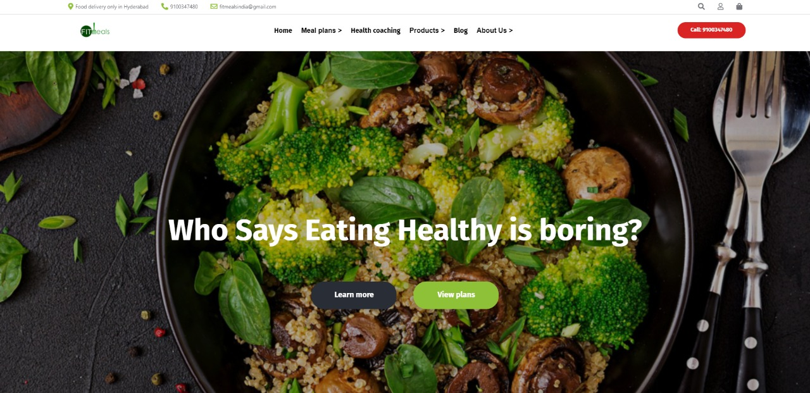

**Fitmeals Clone**

This is a clone of https://www.fitmeals.co.in/ website which is a project we got in my construct week of forth unit in Masai school.

The stack used is HTML, CSS and Javascript, Express.js, mongoose, mongoDB atlas.

The functionality of website such as login, signup, product pages and add to cart has been added.
The website has been made very responsive which is very useful on devices with small screens.

Backend: I created APIs for all product using Express.js, MongoDB and deployed using heroku this is the link of my Product API https://fitmeals-api.herokuapp.com/products 

Frontend: I used HTML,CSS and Javascript to create frontend

Thank you..!!!

